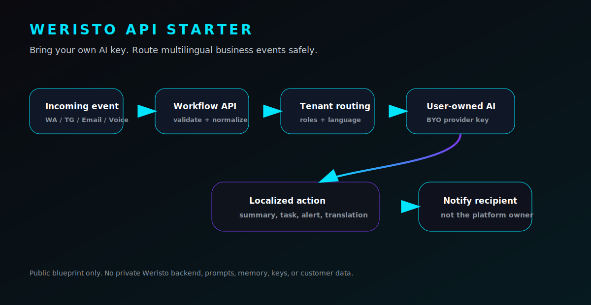
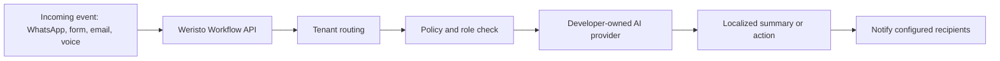

# Weristo API Starter

<p align="center">
  
</p>

<p align="center">
  <strong>Bring your own AI key. Route multilingual business events safely.</strong><br>
  A public blueprint for AI workflow APIs that do not leak tenant data or burn the platform owner's AI budget.
</p>

<p align="center">
  <a href="https://weristo.de/developers.html?utm_source=github&utm_medium=readme&utm_campaign=api_starter">Developer portal</a>
  · <a href="openapi.yaml">OpenAPI spec</a>
  · <a href="docs/architecture.md">Architecture</a>
  · <a href="docs/security-and-tenant-routing.md">Tenant routing</a>
</p>

---

## Why this exists

AI business apps are becoming multi-channel by default: WhatsApp, Telegram, email, webchat, voice, CRM events, and internal alerts all collide in the same workflow.

The hard part is not calling an LLM.

The hard part is deciding:

- whose AI key pays for the call,
- which tenant owns the event,
- who is allowed to see the result,
- what language each recipient expects,
- which channel should receive the notification,
- how to avoid leaking private platform-owner context.

Weristo API Starter shows a clean pattern for that.

## The idea in one sentence

**Weristo is the workflow frame. The API user brings the AI. Tenant routing decides who gets what, in which language, on which channel.**

## What this gives you

- A workflow API shape for business events
- Tenant-aware routing examples
- Bring-your-own-AI provider pattern
- Multilingual notification preferences
- Role-aware notification routing
- Safe webhook examples
- OpenAPI starter spec
- A practical separation between platform logic and tenant-owned AI usage

## Example: multilingual WhatsApp routing

A Spanish WhatsApp message arrives for a German customer account.

1. The webhook receives the message.
2. The tenant config says the owner prefers German.
3. The developer-owned AI provider summarizes the Spanish message in German.
4. The configured recipient gets a Telegram, WhatsApp, or email notification.
5. Otto or Weristo does not receive the tenant's private notifications.

That last point matters. Tenant data should route to the tenant, not to the platform owner.

## What this repository does not include

This is intentionally not a cloneable Weristo backend.

It does **not** include:

- Weristo production backend
- Weri private memory or prompts
- Internal admin logic
- WhatsApp or Telegram production bridge internals
- Customer data
- API keys, tokens, or secrets
- White-label SaaS internals
- Pricing, lead scoring, or private automation logic

## Core flow



## Repository structure

```text
openapi.yaml
examples/
  webhook-router.js
  bring-your-own-ai.js
docs/
  architecture.md
  security-and-tenant-routing.md
  analytics.md
assets/
  architecture.svg
```

## API cost model

Weristo API Starter assumes a **Bring Your Own AI Key** model.

The API user pays their own AI provider directly. Weristo does not silently absorb AI usage generated by third-party API users.

This keeps the business model sane:

- no surprise platform-owner AI bills,
- no cross-tenant data leakage,
- no hidden dependency on Weristo's private provider keys,
- cleaner compliance boundaries.

## Who this is for

- SaaS builders adding AI workflows
- agencies building customer automations
- white-label platform developers
- teams routing WhatsApp, Telegram, email, voice, and CRM events
- anyone building AI features where tenant boundaries matter

## Public analytics

GitHub shows repository traffic under `Insights -> Traffic`:

- views,
- unique visitors,
- clones,
- unique cloners,
- referring sites.

Release asset downloads are tracked per release asset. README image views are not reliably available because GitHub may cache assets.

For campaign analytics, link to the Weristo developer portal with UTM parameters:

```text
https://weristo.de/developers.html?utm_source=github&utm_medium=readme&utm_campaign=api_starter
```

## License

This starter is intended as a public integration blueprint. Add a license before using it in production or accepting external contributions.

---

Built by Weristo: AI workflows for real businesses, not toy demos.
