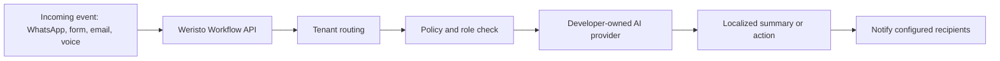

# Weristo API Starter

Bring your own AI key. Route multilingual business events safely.

Weristo API Starter is a public integration blueprint for developers who want to connect websites, CRMs, WhatsApp, Telegram, email, voice, and custom tools to an AI-powered workflow layer.

This repository does **not** contain the private Weristo backend, Weri prompts, tenant engine, customer data, or production secrets. It shows the public integration pattern only.

## What this gives you

- A workflow API shape for business events
- Tenant-aware routing examples
- Bring-your-own-AI provider pattern
- Multilingual notification preferences
- Role-aware notification routing
- Safe webhook examples
- OpenAPI starter spec

## What it does not include

- Weristo production backend
- Weri private memory or prompts
- Internal admin logic
- WhatsApp or Telegram production bridge internals
- Customer data
- API keys, tokens, or secrets

## Core idea

A developer should be able to decide:

- which AI provider is connected,
- which language each recipient uses,
- who receives which notification,
- which events are private, internal, or customer-facing,
- which channels are enabled for a tenant.

Weristo provides the workflow pattern. The API user brings their own AI key and owns their own AI usage cost.



## Example flow

A Spanish WhatsApp message arrives for a German customer account.

1. The webhook receives the message.
2. The tenant config says the owner prefers German.
3. The developer-owned AI provider summarizes the Spanish message in German.
4. The configured recipient gets a Telegram, WhatsApp, or email notification.
5. Otto or Weristo does not receive the tenant's private notifications.

## Repository structure

```text
openapi.yaml
examples/
  webhook-router.js
  bring-your-own-ai.js
docs/
  architecture.md
  security-and-tenant-routing.md
  analytics.md
assets/
  architecture.svg
```

## API cost model

Weristo API Starter assumes a **Bring Your Own AI Key** model.

The API user pays their own AI provider directly. Weristo does not silently absorb AI usage generated by third-party API users.

## Public analytics

GitHub shows repository traffic under `Insights -> Traffic`:

- views,
- unique visitors,
- clones,
- unique cloners,
- referring sites.

Release asset downloads are tracked per release asset. README image views are not reliably available unless you use a dedicated public asset or redirect endpoint.

## License

This starter is intended as a public integration blueprint. Add a license before using it in production or accepting external contributions.
